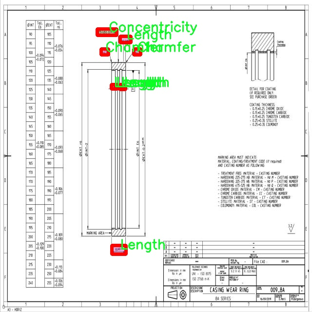

# 工图机械零件特征图像分割系统源码＆数据集分享
 [yolov8-seg-LAWDS＆yolov8-seg-RevCol等50+全套改进创新点发刊_一键训练教程_Web前端展示]

### 1.研究背景与意义

项目参考[ILSVRC ImageNet Large Scale Visual Recognition Challenge](https://gitee.com/YOLOv8_YOLOv11_Segmentation_Studio/projects)

项目来源[AAAI Global Al lnnovation Contest](https://kdocs.cn/l/cszuIiCKVNis)

研究背景与意义

随着工业自动化和智能制造的迅速发展，机械零件的检测与识别在生产过程中变得愈发重要。传统的人工检测方法不仅效率低下，而且容易受到人为因素的影响，导致误判和漏判。因此，基于计算机视觉的自动化检测技术逐渐成为研究的热点。图像分割作为计算机视觉中的一项重要任务，能够有效地将图像中的目标与背景分离，从而为后续的特征提取和分析提供基础。近年来，深度学习技术的迅猛发展，尤其是YOLO（You Only Look Once）系列模型的提出，使得目标检测和图像分割的精度和速度得到了显著提升。

在众多YOLO模型中，YOLOv8因其在精度和实时性上的优越表现，成为了研究者们关注的焦点。然而，针对机械零件特征的图像分割任务，现有的YOLOv8模型仍存在一定的局限性，特别是在复杂背景和多样化零件特征的情况下，分割效果不尽如人意。因此，改进YOLOv8模型以适应工图机械零件特征的图像分割需求，具有重要的理论意义和实际应用价值。

本研究基于Symbol_Seg数据集，包含6700张图像和19个类别的机械零件特征，涵盖了角度、中心度、倒角、同心度、直径、平面度、分组粗糙度、长度、平行度、垂直度、半径、粗糙度、跳动、螺纹、UNC螺纹、总跳动和真实位置等18个类别。这些类别的多样性为模型的训练提供了丰富的样本，有助于提高模型对不同特征的识别能力。同时，数据集的规模也为模型的泛化能力提供了保障。

通过对YOLOv8模型的改进，我们可以引入更为先进的特征提取方法和分割策略，增强模型对机械零件特征的识别精度。此外，结合实例分割技术，能够实现对同一类别中不同实例的精确分割，进一步提升检测的准确性和可靠性。这一改进不仅能够提高机械零件的检测效率，还能降低生产成本，提升产品质量，具有显著的经济效益。

在工业4.0背景下，智能制造的核心在于数据驱动的决策和自动化的生产流程。通过构建基于改进YOLOv8的工图机械零件特征图像分割系统，能够为智能制造提供强有力的技术支持。该系统的成功应用，将为机械零件的在线检测、质量控制和故障诊断等领域提供新的解决方案，推动制造业的数字化转型和智能化升级。

综上所述，本研究不仅在理论上丰富了图像分割和目标检测的研究内容，也在实践中为机械零件的自动化检测提供了新的思路和方法，具有重要的学术价值和广泛的应用前景。

### 2.图片演示


##### 注意：由于此博客编辑较早，上面“2.图片演示”和“3.视频演示”展示的系统图片或者视频可能为老版本，新版本在老版本的基础上升级如下：（实际效果以升级的新版本为准）

  （1）适配了YOLOV8的“目标检测”模型和“实例分割”模型，通过加载相应的权重（.pt）文件即可自适应加载模型。

  （2）支持“图片识别”、“视频识别”、“摄像头实时识别”三种识别模式。

  （3）支持“图片识别”、“视频识别”、“摄像头实时识别”三种识别结果保存导出，解决手动导出（容易卡顿出现爆内存）存在的问题，识别完自动保存结果并导出到tempDir中。

  （4）支持Web前端系统中的标题、背景图等自定义修改，后面提供修改教程。

  另外本项目提供训练的数据集和训练教程,暂不提供权重文件（best.pt）,需要您按照教程进行训练后实现图片演示和Web前端界面演示的效果。

### 3.视频演示

[3.1 视频演示](https://www.bilibili.com/video/BV1cb26YuEab/)

### 4.数据集信息展示

##### 4.1 本项目数据集详细数据（类别数＆类别名）

nc: 19
names: ['18', 'Angle', 'Centrality', 'Chamfer', 'Concentricity', 'Diameter', 'Flatness', 'GroupedRoughness', 'Length', 'Parallelity', 'Perpendicularity', 'Radius', 'Roughness', 'Runout', 'Thread', 'Thread-UNC-', 'Total Runout', 'True Position', 'UNC Thread']


##### 4.2 本项目数据集信息介绍

数据集信息展示

在本研究中，我们使用了名为“Symbol_Seg”的数据集，以支持改进YOLOv8-seg的工图机械零件特征图像分割系统的训练与验证。该数据集专门针对机械零件的特征进行标注，涵盖了19个不同的类别，这些类别分别代表了机械零件设计与制造中常见的几何特征和公差要求。通过对这些特征的精确分割与识别，系统能够更好地理解和分析工图，从而提高自动化检测和质量控制的效率。

“Symbol_Seg”数据集的类别列表包括：18、Angle、Centrality、Chamfer、Concentricity、Diameter、Flatness、GroupedRoughness、Length、Parallelity、Perpendicularity、Radius、Roughness、Runout、Thread、Thread-UNC-、Total Runout、True Position以及UNC Thread。这些类别不仅涵盖了机械零件的基本几何形状和尺寸，还涉及到多种公差与精度要求，反映了现代机械设计中对细节的严格把控。

在图像分割任务中，准确识别和分离这些特征至关重要。每个类别的特征图像都经过精细标注，确保了模型在训练过程中能够学习到丰富的特征信息。例如，Angle和Diameter类别帮助模型理解零件的角度和直径，而Chamfer和Concentricity则强调了边缘处理和同心度的重要性。这些信息不仅有助于提高分割精度，还能为后续的特征分析提供坚实的基础。

此外，数据集中的每个类别都包含了多样化的样本，以确保模型在面对不同的工图时具备良好的泛化能力。通过引入各种工件的图像，模型能够学习到不同背景、光照条件和视角下的特征表现，从而增强其在实际应用中的鲁棒性。这种多样性是实现高效图像分割的关键，尤其是在工业环境中，工件的外观可能因加工方式、材料和使用情况而大相径庭。

为了进一步提升模型的性能，我们在数据预处理阶段对图像进行了标准化处理，包括缩放、旋转和噪声添加等操作。这些技术不仅增加了数据集的有效样本量，还帮助模型适应各种可能的输入条件。通过这种方式，我们期望“Symbol_Seg”数据集能够为YOLOv8-seg模型提供丰富的训练素材，使其在特征分割任务中表现出色。

总之，“Symbol_Seg”数据集的构建与应用为改进YOLOv8-seg的工图机械零件特征图像分割系统提供了坚实的基础。通过对19个类别的深入研究与分析，我们相信该数据集将显著提升模型的识别能力与分割精度，为机械零件的自动化检测与质量控制提供强有力的支持。随着技术的不断进步，我们期待这一系统能够在实际工业应用中发挥更大的作用，推动机械制造领域的智能化发展。





### 5.全套项目环境部署视频教程（零基础手把手教学）

[5.1 环境部署教程链接（零基础手把手教学）](https://www.bilibili.com/video/BV1jG4Ve4E9t/?vd_source=bc9aec86d164b67a7004b996143742dc)


[5.2 安装Python虚拟环境创建和依赖库安装视频教程链接（零基础手把手教学）](https://www.bilibili.com/video/BV1nA4VeYEze/?vd_source=bc9aec86d164b67a7004b996143742dc)

### 6.手把手YOLOV8-seg训练视频教程（零基础小白有手就能学会）

[6.1 手把手YOLOV8-seg训练视频教程（零基础小白有手就能学会）](https://www.bilibili.com/video/BV1cA4VeYETe/?vd_source=bc9aec86d164b67a7004b996143742dc)


按照上面的训练视频教程链接加载项目提供的数据集，运行train.py即可开始训练



     Epoch   gpu_mem       box       obj       cls    labels  img_size
     1/200     0G   0.01576   0.01955  0.007536        22      1280: 100%|██████████| 849/849 [14:42<00:00,  1.04s/it]
               Class     Images     Labels          P          R     mAP@.5 mAP@.5:.95: 100%|██████████| 213/213 [01:14<00:00,  2.87it/s]
                 all       3395      17314      0.994      0.957      0.0957      0.0843

     Epoch   gpu_mem       box       obj       cls    labels  img_size
     2/200     0G   0.01578   0.01923  0.007006        22      1280: 100%|██████████| 849/849 [14:44<00:00,  1.04s/it]
               Class     Images     Labels          P          R     mAP@.5 mAP@.5:.95: 100%|██████████| 213/213 [01:12<00:00,  2.95it/s]
                 all       3395      17314      0.996      0.956      0.0957      0.0845

     Epoch   gpu_mem       box       obj       cls    labels  img_size
     3/200     0G   0.01561    0.0191  0.006895        27      1280: 100%|██████████| 849/849 [10:56<00:00,  1.29it/s]
               Class     Images     Labels          P          R     mAP@.5 mAP@.5:.95: 100%|███████   | 187/213 [00:52<00:00,  4.04it/s]
                 all       3395      17314      0.996      0.957      0.0957      0.0845


### 7.50+种全套YOLOV8-seg创新点代码加载调参视频教程（一键加载写好的改进模型的配置文件）

[7.1 50+种全套YOLOV8-seg创新点代码加载调参视频教程（一键加载写好的改进模型的配置文件）](https://www.bilibili.com/video/BV1Hw4VePEXv/?vd_source=bc9aec86d164b67a7004b996143742dc)

### 8.YOLOV8-seg图像分割算法原理

原始YOLOv8-seg算法原理

YOLOv8-seg算法是目标检测领域的最新进展，基于YOLOv8算法的核心架构，进一步扩展了其在图像分割任务中的应用。YOLOv8-seg的设计理念不仅继承了YOLO系列算法的高效性和准确性，还通过引入新的特征提取模块和优化的网络结构，提升了在复杂场景下的分割性能。其整体框架仍然遵循输入层、主干网络、特征融合层和解耦头的结构设计，但在每个模块中都进行了创新和改进，以适应分割任务的需求。

在主干网络部分，YOLOv8-seg依然采用了CSPDarknet的思想，利用C2f模块替代了YOLOv5中的C3模块。C2f模块的设计充分考虑了特征的多样性和梯度流的优化。该模块通过将输入特征图分为两个分支，分别进行卷积操作并在后续阶段进行特征融合，显著提高了特征提取的效率。通过引入ELAN（Efficient Layer Aggregation Network）思想，C2f模块不仅增强了梯度流的传递，还提升了浅层特征的重用能力，从而有效缓解了深层网络中的梯度消失问题。

在特征融合层，YOLOv8-seg采用了PAN-FPN（Path Aggregation Network with Feature Pyramid Network）结构，旨在实现多尺度特征的深度融合。该结构通过自下而上的特征融合过程，充分利用了不同层次的特征信息，确保了在进行目标分割时，既能保留细节信息，又能获取高层语义信息。具体而言，YOLOv8-seg在特征融合过程中，删除了上采样阶段的1x1卷积，直接将高层特征与中层特征进行拼接，进一步增强了特征的表达能力。

YOLOv8-seg在目标检测的基础上，特别针对分割任务进行了优化，采用了Anchor-Free的思想。这一转变使得模型在处理目标时，不再依赖于预设的锚框，而是直接预测目标的中心点及其边界。这种方法不仅简化了模型的复杂性，还提高了检测的速度和准确性。此外，YOLOv8-seg引入了新的损失函数设计，包括VFLLoss和DFLLoss+CIoULoss，分别用于分类和边界框回归，进一步提升了模型在分割任务中的表现。

在样本匹配策略方面，YOLOv8-seg采用了Task-Aligned的Assigner匹配方式，这一策略的引入使得模型在训练过程中能够更好地适应不同任务的需求，提高了样本匹配的灵活性和准确性。通过这种动态匹配方式，YOLOv8-seg能够在多样化的训练数据中有效识别和分割目标，提高了模型的泛化能力。

数据预处理环节，YOLOv8-seg沿用了YOLOv5的增强策略，包括马赛克增强、混合增强、空间扰动和颜色扰动等。这些数据增强手段不仅丰富了训练样本的多样性，还有效提高了模型的鲁棒性，特别是在面对复杂背景和多变光照条件时，能够显著提升分割效果。

在网络的头部结构设计上，YOLOv8-seg借鉴了YOLOX和YOLOv6的解耦头部分，取消了objectness分支，简化了模型的输出结构。通过将分类和回归分支解耦，YOLOv8-seg能够更有效地进行目标的边框回归和类别预测。具体而言，模型输出的特征图被处理为多个尺度的特征图，结合Softmax和卷积操作，最终生成目标的边界框和类别信息。

值得注意的是，YOLOv8-seg在处理小目标和复杂背景时，特别引入了Focal Loss损失函数，以应对样本不平衡的问题。通过调整损失函数中的平衡参数和聚焦参数，YOLOv8-seg能够有效提升对难以识别的小目标的检测能力，确保在实际应用中，模型能够在多种场景下保持高效的分割性能。

综上所述，YOLOv8-seg算法通过对YOLOv8的各个模块进行创新和优化，成功地将目标检测与图像分割相结合，形成了一种高效、准确的分割模型。其在特征提取、特征融合、样本匹配和损失函数等方面的改进，使得YOLOv8-seg在处理复杂场景和多样化目标时，展现出了卓越的性能，标志着目标检测与分割领域的又一次技术飞跃。随着YOLOv8-seg的不断发展和应用，未来在智能监控、自动驾驶、医学影像等领域，必将发挥更为重要的作用。


### 9.系统功能展示（检测对象为举例，实际内容以本项目数据集为准）

图9.1.系统支持检测结果表格显示

  图9.2.系统支持置信度和IOU阈值手动调节

  图9.3.系统支持自定义加载权重文件best.pt(需要你通过步骤5中训练获得)

  图9.4.系统支持摄像头实时识别

  图9.5.系统支持图片识别

  图9.6.系统支持视频识别

  图9.7.系统支持识别结果文件自动保存

  图9.8.系统支持Excel导出检测结果数据


### 10.50+种全套YOLOV8-seg创新点原理讲解（非科班也可以轻松写刊发刊，V11版本正在科研待更新）

#### 10.1 由于篇幅限制，每个创新点的具体原理讲解就不一一展开，具体见下列网址中的创新点对应子项目的技术原理博客网址【Blog】：


[10.1 50+种全套YOLOV8-seg创新点原理讲解链接](https://gitee.com/qunmasj/good)

#### 10.2 部分改进模块原理讲解(完整的改进原理见上图和技术博客链接)【如果此小节的图加载失败可以通过CSDN或者Github搜索该博客的标题访问原始博客，原始博客图片显示正常】

### YOLOv8简介


由上图可以看出，C2中每个BottlNeck的输入Tensor的通道数channel都只是上一级的0.5倍，因此计算量明显降低。从另一方面讲，梯度流的增加，t也能够明显提升收敛速度和收敛效果。
C2i模块首先以输入tensor(n.c.h.w)经过Conv1层进行split拆分，分成两部分(n,0.5c,h,w)，一部分直接经过n个Bottlenck，另一部分经过每一操作层后都会以(n.0.5c,h,w)的尺寸进行Shortcut，最后通过Conv2层卷积输出。也就是对应n+2的Shortcut(第一层Conv1的分支tensor和split后的tensor为2+n个bottenlenneck)。
#### Neck
YOLOv8的Neck采用了PANet结构，如下图所示。

Backbone最后SPPF模块(Layer9)之后H、W经过32倍下采样，对应地Layer4经过8倍下采样，Layer6经过16倍下采样。输入图片分辨率为640*640，得到Layer4、Layer6、Layer9的分辨率分别为80*80、40*40和20*20。
Layer4、Layer6、Layer9作为PANet结构的输入，经过上采样，通道融合，最终将PANet的三个输出分支送入到Detect head中进行Loss的计算或结果解算。
与FPN(单向，自上而下)不同的是，PANet是一个双向通路网络，引入了自下向上的路径，使得底层信息更容易传递到顶层。
#### Head
Head部分相比Yolov5改动较大，直接将耦合头改为类似Yolo的解耦头结构(Decoupled-Head)，将回归分支和预测分支分离，并针对回归分支使用了Distribution Focal Loss策略中提出的积分形式表示法。之前的目标检测网络将回归坐标作为一个确定性单值进行预测，DFL将坐标转变成一个分布。


### LSKNet的架构
该博客提出的结构层级依次为：

LSK module（大核卷积序列+空间选择机制） < LSK Block （LK Selection + FFN）<LSKNet（N个LSK Block）


#### LSK 模块

LSK Block
LSKNet 是主干网络中的一个可重复堆叠的块（Block），每个LSK Block包括两个残差子块，即大核选择子块（Large Kernel Selection，LK Selection）和前馈网络子块（Feed-forward Network ，FFN），如图8。LK Selection子块根据需要动态地调整网络的感受野，FFN子块用于通道混合和特征细化，由一个全连接层、一个深度卷积、一个 GELU 激活和第二个全连接层组成。

LSK module（LSK 模块，图4）由一个大核卷积序列（large kernel convolutions）和一个空间核选择机制（spatial kernel selection mechanism）组成，被嵌入到了LSK Block 的 LK Selection子块中。

#### Large Kernel Convolutions
因为不同类型的目标对背景信息的需求不同，这就需要模型能够自适应选择不同大小的背景范围。因此，作者通过解耦出一系列具有大卷积核、且不断扩张的Depth-wise 卷积，构建了一个更大感受野的网络。

具体地，假设序列中第i个Depth-wise 卷积核的大小为 ，扩张率为 d，感受野为 ，它们满足以下关系：


卷积核大小和扩张率的增加保证了感受野能够快速增大。此外，我们设置了扩张率的上限，以保证扩张卷积不会引入特征图之间的差距。


Table2的卷积核大小可根据公式（1）和（2）计算，详见下图：


这样设计的好处有两点。首先，能够产生具有多种不同大小感受野的特征，便于后续的核选择；第二，序列解耦比简单的使用一个大型卷积核效果更好。如上图表2所示，解耦操作相对于标准的大型卷积核，有效地将低了模型的参数量。

为了从输入数据  的不同区域获取丰富的背景信息特征，可采用一系列解耦的、不用感受野的Depth-wise 卷积核：


其中，是卷积核为 、扩张率为  的Depth-wise 卷积操作。假设有个解耦的卷积核，每个卷积操作后又要经过一个的卷积层进行空间特征向量的通道融合。


之后，针对不同的目标，可基于获取的多尺度特征，通过下文中的选择机制动态选择合适的卷积核大小。

这一段的意思可以简单理解为：

把一个大的卷积核拆成了几个小的卷积核，比如一个大小为5，扩张率为1的卷积核加上一个大小为7，扩张率为3的卷积核，感受野为23，与一个大小为23，扩张率为1的卷积核的感受野是一样的。因此可用两个小的卷积核替代一个大的卷积核，同理一个大小为29的卷积核也可以用三个小的卷积代替（Table 2），这样可以有效的减少参数，且更灵活。

将输入数据依次通过这些小的卷积核（公式3），并在每个小的卷积核后面接上一个1×1的卷积进行通道融合（公式4）。

#### Spatial Kernel Selection
为了使模型更关注目标在空间上的重点背景信息，作者使用空间选择机制从不同尺度的大卷积核中对特征图进行空间选择。

首先，将来自于不同感受野卷积核的特征进行concate拼接，然后，应用通道级的平均池化和最大池化提取空间关系，其中， 和  是平均池化和最大池化后的空间特征描述符。为了实现不同空间描述符的信息交互，作者利用卷积层将空间池化特征进行拼接，将2个通道的池化特征转换为N个空间注意力特征图，之后，将Sigmoid激活函数应用到每一个空间注意力特征图，可获得每个解耦的大卷积核所对应的独立的空间选择掩膜，又然后，将解耦后的大卷积核序列的特征与对应的空间选择掩膜进行加权处理，并通过卷积层进行融合获得注意力特征 ，最后LSK module的输出可通过输入特征  与注意力特征  的逐元素点成获得，公式对应于结构图上的操作如下：


### 11.项目核心源码讲解（再也不用担心看不懂代码逻辑）

#### 11.1 ultralytics\nn\modules\__init__.py

以下是对代码的核心部分进行分析和详细注释的结果：

```python
# Ultralytics YOLO 🚀, AGPL-3.0 license
"""
Ultralytics模块的导入。

示例：
    使用Netron可视化模块。
    ```python
    from ultralytics.nn.modules import *
    import torch
    import os

    x = torch.ones(1, 128, 40, 40)  # 创建一个形状为(1, 128, 40, 40)的全1张量
    m = Conv(128, 128)  # 实例化一个卷积层，输入和输出通道均为128
    f = f'{m._get_name()}.onnx'  # 获取模型名称并生成ONNX文件名
    torch.onnx.export(m, x, f)  # 将模型导出为ONNX格式
    os.system(f'onnxsim {f} {f} && open {f}')  # 优化ONNX模型并打开文件
    ```
"""

# 从不同模块导入核心组件
from .block import *  # 导入block模块，通常包含网络的基本构建块
from .conv import *   # 导入conv模块，包含卷积层的实现
from .head import *   # 导入head模块，通常包含网络的输出层或头部结构
from .transformer import *  # 导入transformer模块，可能包含变换器结构的实现
```

### 代码分析与注释：

1. **模块导入**：
   - 代码中使用了相对导入的方式，导入了多个模块（`block`, `conv`, `head`, `transformer`），这些模块可能包含构建YOLO模型所需的各种层和结构。

2. **示例代码**：
   - 示例代码展示了如何使用`torch`库创建一个张量，并实例化一个卷积层。
   - 使用`torch.onnx.export`将模型导出为ONNX格式，这是一种常用的深度学习模型交换格式，便于在不同框架之间共享模型。
   - 最后，通过系统命令优化ONNX模型并打开该文件。

### 核心部分：
- 代码的核心在于模块的导入和示例中的卷积层的创建与导出，这些是构建和使用YOLO模型的基础。

这个文件是Ultralytics YOLO项目中的一个模块初始化文件，遵循AGPL-3.0许可证。文件的主要功能是导入和组织与神经网络相关的模块，以便在其他地方使用。

在文件的开头，有一个文档字符串，简要说明了这个模块的用途，并提供了一个示例代码。示例代码展示了如何使用这个模块来可视化一个神经网络模型。具体来说，它首先导入了必要的库，包括`torch`和`os`。接着，创建了一个形状为(1, 128, 40, 40)的张量`x`，这通常表示一个批次的输入数据，包含128个通道，尺寸为40x40的特征图。

然后，示例代码实例化了一个卷积层`Conv`，输入和输出的通道数都是128。接下来，使用`torch.onnx.export`函数将这个卷积层导出为ONNX格式的模型文件，文件名为`m._get_name() + '.onnx'`。这个文件可以被其他深度学习框架使用，便于模型的互操作性。

最后，示例代码使用`os.system`命令调用`onnxsim`工具对导出的ONNX模型进行优化，并尝试打开生成的文件。这一过程展示了如何将定义的模块导出并进行后续处理。

在文件的最后部分，使用了相对导入的方式，导入了其他几个模块，包括`block`、`conv`、`head`和`transformer`。这些模块可能包含了构建神经网络所需的不同组件和功能，使得整个代码结构更加模块化和清晰。通过这种方式，用户可以方便地使用这些功能，而不需要在每个文件中重复导入。

#### 11.2 ultralytics\data\dataset.py

以下是代码中最核心的部分，并附上详细的中文注释：

```python
import numpy as np
import torch
from pathlib import Path
from ultralytics.utils import TQDM, get_hash, LOGGER, img2label_paths
from .base import BaseDataset

# Ultralytics 数据集缓存版本，>= 1.0.0 用于 YOLOv8
DATASET_CACHE_VERSION = '1.0.3'

class YOLODataset(BaseDataset):
    """
    YOLO 数据集类，用于加载 YOLO 格式的目标检测和/或分割标签。

    参数:
        data (dict, optional): 数据集 YAML 字典。默认为 None。
        use_segments (bool, optional): 如果为 True，则使用分割掩码作为标签。默认为 False。
        use_keypoints (bool, optional): 如果为 True，则使用关键点作为标签。默认为 False。

    返回:
        (torch.utils.data.Dataset): 可用于训练目标检测模型的 PyTorch 数据集对象。
    """

    def __init__(self, *args, data=None, use_segments=False, use_keypoints=False, **kwargs):
        """初始化 YOLODataset，带有可选的分段和关键点配置。"""
        self.use_segments = use_segments  # 是否使用分割掩码
        self.use_keypoints = use_keypoints  # 是否使用关键点
        self.data = data  # 数据集配置
        assert not (self.use_segments and self.use_keypoints), '不能同时使用分段和关键点。'
        super().__init__(*args, **kwargs)

    def cache_labels(self, path=Path('./labels.cache')):
        """
        缓存数据集标签，检查图像并读取形状。

        参数:
            path (Path): 保存缓存文件的路径（默认: Path('./labels.cache')）。
        返回:
            (dict): 标签字典。
        """
        x = {'labels': []}  # 初始化标签字典
        nm, nf, ne, nc, msgs = 0, 0, 0, 0, []  # 统计缺失、找到、空、损坏的数量及消息
        total = len(self.im_files)  # 图像文件总数

        # 使用多线程验证图像和标签
        with ThreadPool(NUM_THREADS) as pool:
            results = pool.imap(func=verify_image_label,
                                iterable=zip(self.im_files, self.label_files))
            pbar = TQDM(results, desc='扫描中...', total=total)  # 进度条
            for im_file, lb, shape, segments, keypoint, nm_f, nf_f, ne_f, nc_f, msg in pbar:
                nm += nm_f  # 更新缺失数量
                nf += nf_f  # 更新找到数量
                ne += ne_f  # 更新空数量
                nc += nc_f  # 更新损坏数量
                if im_file:
                    x['labels'].append(
                        dict(
                            im_file=im_file,
                            shape=shape,
                            cls=lb[:, 0:1],  # 类别
                            bboxes=lb[:, 1:],  # 边界框
                            segments=segments,
                            keypoints=keypoint,
                            normalized=True,
                            bbox_format='xywh'))  # 边界框格式
                if msg:
                    msgs.append(msg)  # 收集消息
                pbar.desc = f'扫描中... {nf} 图像, {nm + ne} 背景, {nc} 损坏'
            pbar.close()

        if msgs:
            LOGGER.info('\n'.join(msgs))  # 记录警告信息
        if nf == 0:
            LOGGER.warning(f'警告 ⚠️ 在 {path} 中未找到标签。')
        x['hash'] = get_hash(self.label_files + self.im_files)  # 计算标签和图像文件的哈希值
        save_dataset_cache_file(self.prefix, path, x)  # 保存缓存文件
        return x

    def get_labels(self):
        """返回 YOLO 训练的标签字典。"""
        self.label_files = img2label_paths(self.im_files)  # 获取标签文件路径
        cache_path = Path(self.label_files[0]).parent.with_suffix('.cache')  # 缓存文件路径
        try:
            cache, exists = load_dataset_cache_file(cache_path), True  # 尝试加载缓存文件
            assert cache['version'] == DATASET_CACHE_VERSION  # 检查版本
            assert cache['hash'] == get_hash(self.label_files + self.im_files)  # 检查哈希值
        except (FileNotFoundError, AssertionError, AttributeError):
            cache, exists = self.cache_labels(cache_path), False  # 运行缓存操作

        # 显示缓存信息
        nf, nm, ne, nc, n = cache.pop('results')  # 提取结果信息
        if exists:
            d = f'扫描 {cache_path}... {nf} 图像, {nm + ne} 背景, {nc} 损坏'
            TQDM(None, desc=self.prefix + d, total=n, initial=n)  # 显示结果
            if cache['msgs']:
                LOGGER.info('\n'.join(cache['msgs']))  # 显示警告

        # 读取缓存
        labels = cache['labels']  # 获取标签
        if not labels:
            LOGGER.warning(f'警告 ⚠️ 在 {cache_path} 中未找到图像，训练可能无法正常工作。')
        self.im_files = [lb['im_file'] for lb in labels]  # 更新图像文件列表
        return labels  # 返回标签

    @staticmethod
    def collate_fn(batch):
        """将数据样本合并为批次。"""
        new_batch = {}
        keys = batch[0].keys()  # 获取键
        values = list(zip(*[list(b.values()) for b in batch]))  # 获取值
        for i, k in enumerate(keys):
            value = values[i]
            if k == 'img':
                value = torch.stack(value, 0)  # 堆叠图像
            if k in ['masks', 'keypoints', 'bboxes', 'cls']:
                value = torch.cat(value, 0)  # 合并掩码、关键点、边界框和类别
            new_batch[k] = value  # 更新新批次
        return new_batch  # 返回合并后的批次
```

### 代码核心部分说明：
1. **YOLODataset 类**：该类用于加载 YOLO 格式的数据集，支持目标检测和分割任务。
2. **初始化方法**：初始化数据集，配置是否使用分割和关键点。
3. **cache_labels 方法**：缓存标签，检查图像有效性，并读取其形状。
4. **get_labels 方法**：获取标签，支持从缓存加载和验证。
5. **collate_fn 方法**：将多个样本合并为一个批次，便于后续处理。

这些核心部分是 YOLO 数据集处理的基础，确保数据的有效性和可用性。

这个程序文件主要定义了用于YOLO（You Only Look Once）目标检测和分类的两个数据集类：`YOLODataset`和`ClassificationDataset`，以及一些辅助函数。文件中使用了Python的多线程和路径处理库，主要用于处理图像数据和标签，支持数据缓存和增强。

`YOLODataset`类是一个继承自`BaseDataset`的类，专门用于加载YOLO格式的目标检测和分割标签。它的构造函数接受一些参数，包括数据配置、是否使用分割掩码和关键点等。类中有一个`cache_labels`方法，用于缓存数据集标签，检查图像并读取其形状。该方法会遍历图像文件和标签文件，验证它们的有效性，并生成一个缓存文件以加速后续的数据加载。

`get_labels`方法返回用于YOLO训练的标签字典。它尝试加载之前生成的缓存文件，如果文件不存在或不匹配，则调用`cache_labels`重新生成标签。此方法还会检查标签的完整性，确保框和分割的数量一致。

`build_transforms`方法用于构建数据增强的转换操作，支持不同的增强策略。`update_labels_info`方法则用于自定义标签格式，便于后续处理。

`collate_fn`方法用于将多个数据样本合并成一个批次，方便后续的训练过程。

`ClassificationDataset`类继承自`torchvision.datasets.ImageFolder`，用于处理YOLO分类数据集。它的构造函数接收数据集路径、参数设置、增强和缓存选项。该类实现了`__getitem__`和`__len__`方法，以便按索引获取样本和返回样本总数。

`verify_images`方法用于验证数据集中所有图像的有效性，并生成缓存文件以加速后续的加载过程。

文件还定义了两个辅助函数：`load_dataset_cache_file`和`save_dataset_cache_file`，分别用于加载和保存数据集的缓存文件。这些函数使用NumPy库来处理缓存数据，并通过日志记录相关信息。

最后，文件中还有一个`SemanticDataset`类的定义，作为语义分割数据集的占位符，目前尚未实现具体功能。整体来看，这个文件为YOLO模型的训练提供了数据集的管理和处理功能，确保数据的有效性和高效性。

#### 11.3 ui.py

以下是代码中最核心的部分，并附上详细的中文注释：

```python
import sys
import subprocess

def run_script(script_path):
    """
    使用当前 Python 环境运行指定的脚本。

    Args:
        script_path (str): 要运行的脚本路径

    Returns:
        None
    """
    # 获取当前 Python 解释器的路径
    python_path = sys.executable

    # 构建运行命令，使用 streamlit 运行指定的脚本
    command = f'"{python_path}" -m streamlit run "{script_path}"'

    # 执行命令，并等待其完成
    result = subprocess.run(command, shell=True)
    
    # 检查命令执行结果，如果返回码不为0，则表示执行出错
    if result.returncode != 0:
        print("脚本运行出错。")

# 实例化并运行应用
if __name__ == "__main__":
    # 指定要运行的脚本路径
    script_path = "web.py"  # 这里可以直接指定脚本名称

    # 调用函数运行脚本
    run_script(script_path)
```

### 代码注释说明：
1. **导入模块**：
   - `sys`：用于访问与 Python 解释器紧密相关的变量和函数。
   - `subprocess`：用于创建新进程、连接到它们的输入/输出/错误管道，并获取返回码。

2. **`run_script` 函数**：
   - 定义了一个函数，用于运行指定路径的 Python 脚本。
   - `script_path` 参数是要运行的脚本的路径。

3. **获取 Python 解释器路径**：
   - 使用 `sys.executable` 获取当前 Python 解释器的完整路径，以确保在正确的环境中运行脚本。

4. **构建命令**：
   - 使用 `f-string` 格式化字符串构建命令，命令中包含了 Python 解释器的路径和要运行的脚本。

5. **执行命令**：
   - 使用 `subprocess.run` 执行构建的命令，并等待命令完成。

6. **检查执行结果**：
   - 检查命令的返回码，如果返回码不为0，表示脚本运行过程中出现了错误，打印出错信息。

7. **主程序入口**：
   - 在 `if __name__ == "__main__":` 块中，指定要运行的脚本路径，并调用 `run_script` 函数执行该脚本。

这个程序文件的主要功能是通过当前的 Python 环境来运行一个指定的脚本，具体来说是运行一个名为 `web.py` 的脚本。程序首先导入了必要的模块，包括 `sys`、`os` 和 `subprocess`，这些模块分别用于获取系统信息、处理文件路径和执行系统命令。

在程序中定义了一个名为 `run_script` 的函数，该函数接受一个参数 `script_path`，表示要运行的脚本的路径。函数内部首先获取当前 Python 解释器的路径，使用 `sys.executable` 来实现。接着，构建一个命令字符串，命令的格式是通过 Python 解释器运行 `streamlit` 模块，并指定要运行的脚本。

使用 `subprocess.run` 方法来执行构建好的命令，`shell=True` 参数表示在 shell 中执行该命令。执行后，程序会检查返回的结果，如果返回码不为零，说明脚本运行出错，程序会打印出相应的错误信息。

在文件的最后部分，使用 `if __name__ == "__main__":` 来确保当该文件作为主程序运行时，才会执行以下代码。这里指定了要运行的脚本路径为 `web.py`，并调用 `run_script` 函数来执行这个脚本。

整体来看，这个程序是一个简单的脚本执行器，主要用于运行一个特定的 Python 脚本，并处理可能出现的错误。

#### 11.4 ultralytics\__init__.py

以下是代码中最核心的部分，并附上详细的中文注释：

```python
# Ultralytics YOLO 🚀, AGPL-3.0 license

# 定义当前版本
__version__ = '8.0.202'

# 从ultralytics.models模块导入YOLO、RTDETR、SAM等模型
from ultralytics.models import RTDETR, SAM, YOLO
from ultralytics.models.fastsam import FastSAM  # 导入FastSAM模型
from ultralytics.models.nas import NAS  # 导入NAS模型

# 导入设置和检查工具
from ultralytics.utils import SETTINGS as settings  # 导入设置
from ultralytics.utils.checks import check_yolo as checks  # 导入YOLO检查工具
from ultralytics.utils.downloads import download  # 导入下载工具

# 定义模块的公共接口，包含版本、模型和工具
__all__ = '__version__', 'YOLO', 'NAS', 'SAM', 'FastSAM', 'RTDETR', 'checks', 'download', 'settings'
```

### 注释说明：
1. **版本定义**：`__version__` 用于标识当前代码的版本，方便管理和更新。
2. **模型导入**：通过 `from` 语句导入不同的模型（如 YOLO、RTDETR、SAM 等），这些模型是进行目标检测和分割等任务的核心组件。
3. **工具导入**：
   - `SETTINGS` 用于配置和设置相关参数。
   - `check_yolo` 是一个检查工具，用于验证 YOLO 模型的有效性和兼容性。
   - `download` 用于处理模型或数据的下载功能。
4. **公共接口**：`__all__` 定义了模块的公共接口，指定了在使用 `from module import *` 时，哪些名称是可导出的。这有助于控制模块的可见性和使用方式。

这个程序文件是Ultralytics库的初始化文件，文件名为`__init__.py`，它的主要作用是定义库的版本、导入相关模块和类，并指定公共接口。

首先，文件中定义了库的版本号为`8.0.202`，这有助于用户和开发者了解当前使用的库版本，便于进行版本管理和更新。

接下来，文件从`ultralytics.models`模块中导入了多个模型类，包括`RTDETR`、`SAM`和`YOLO`。这些模型是Ultralytics库中实现的不同计算机视觉模型，用户可以根据需求选择使用。

此外，文件还导入了`FastSAM`和`NAS`，这两个类可能是与特定任务或优化相关的模型，进一步扩展了库的功能。

在工具方面，文件从`ultralytics.utils`模块中导入了`SETTINGS`、`check_yolo`和`download`等实用工具。`SETTINGS`可能包含库的配置参数，`check_yolo`用于检查YOLO模型的状态或配置，而`download`则提供了下载模型或数据集的功能。

最后，文件通过`__all__`变量定义了公共接口，列出了可以被外部访问的模块和类。这意味着当用户使用`from ultralytics import *`时，只会导入这些指定的对象，从而避免了命名冲突和不必要的导入。

总的来说，这个`__init__.py`文件是Ultralytics库的核心组成部分，负责初始化库的版本、导入模型和工具，并定义公共接口，方便用户使用。

#### 11.5 train.py

以下是代码中最核心的部分，并附上详细的中文注释：

```python
import os
import torch
import yaml
from ultralytics import YOLO  # 导入YOLO模型

if __name__ == '__main__':  # 确保该模块被直接运行时才执行以下代码
    # 设置训练参数
    workers = 1  # 数据加载的工作进程数量
    batch = 8  # 每个批次的样本数量，视显存情况调整
    device = "0" if torch.cuda.is_available() else "cpu"  # 判断是否使用GPU

    # 获取数据集配置文件的绝对路径
    data_path = abs_path(f'datasets/data/data.yaml', path_type='current')

    # 读取YAML文件，保持原有顺序
    with open(data_path, 'r') as file:
        data = yaml.load(file, Loader=yaml.FullLoader)

    # 修改数据集路径为绝对路径
    if 'train' in data and 'val' in data and 'test' in data:
        directory_path = os.path.dirname(data_path)  # 获取数据集目录路径
        data['train'] = os.path.join(directory_path, 'train')  # 更新训练集路径
        data['val'] = os.path.join(directory_path, 'val')  # 更新验证集路径
        data['test'] = os.path.join(directory_path, 'test')  # 更新测试集路径

        # 将修改后的数据写回YAML文件
        with open(data_path, 'w') as file:
            yaml.safe_dump(data, file, sort_keys=False)

    # 加载YOLO模型配置文件和预训练权重
    model = YOLO(r"C:\codeseg\codenew\50+种YOLOv8算法改进源码大全和调试加载训练教程（非必要）\改进YOLOv8模型配置文件\yolov8-seg-C2f-Faster.yaml").load("./weights/yolov8s-seg.pt")

    # 开始训练模型
    results = model.train(
        data=data_path,  # 指定训练数据的配置文件路径
        device=device,  # 指定使用的设备（GPU或CPU）
        workers=workers,  # 指定数据加载的工作进程数量
        imgsz=640,  # 输入图像的大小为640x640
        epochs=100,  # 训练100个epoch
        batch=batch,  # 每个批次的样本数量
    )
```

### 代码注释说明：
1. **导入库**：导入必要的库，包括操作系统库、PyTorch、YAML解析库和YOLO模型库。
2. **主程序入口**：使用`if __name__ == '__main__':`确保代码仅在直接运行时执行。
3. **设置训练参数**：定义数据加载的工作进程数量、批次大小和设备类型（GPU或CPU）。
4. **获取数据集配置文件路径**：使用`abs_path`函数获取数据集配置文件的绝对路径。
5. **读取和修改YAML文件**：读取YAML文件，更新训练、验证和测试集的路径为绝对路径，并将修改后的内容写回文件。
6. **加载YOLO模型**：根据指定的配置文件和预训练权重加载YOLO模型。
7. **训练模型**：调用`model.train`方法开始训练，传入训练数据路径、设备、工作进程数量、图像大小、训练轮数和批次大小等参数。

这个程序文件 `train.py` 是用于训练 YOLO（You Only Look Once）模型的脚本，主要使用了 PyTorch 框架和 Ultralytics 提供的 YOLO 实现。程序的结构相对简单，主要包括数据准备、模型加载和训练过程。

首先，程序导入了必要的库，包括 `os`、`torch`、`yaml` 和 `matplotlib`。其中，`torch` 是深度学习框架，`yaml` 用于处理 YAML 格式的配置文件，`matplotlib` 用于绘图（在这里设置为 `TkAgg` 后端）。

在 `if __name__ == '__main__':` 语句下，程序开始执行主要逻辑。首先设置了一些训练参数，包括工作进程数 `workers`、批次大小 `batch` 和设备类型 `device`。设备类型根据是否有可用的 GPU 来选择，如果有则使用 GPU（设备编号为 "0"），否则使用 CPU。

接下来，程序构建了数据集配置文件的绝对路径 `data_path`，该路径指向一个 YAML 文件，文件中包含了训练、验证和测试数据的路径。程序使用 `os.path.dirname` 获取数据集目录的路径，并读取 YAML 文件内容。读取后，程序检查 YAML 文件中是否包含 `train`、`val` 和 `test` 项，如果有，则将这些项的路径修改为绝对路径，确保模型可以正确找到数据集。修改完成后，程序将更新后的数据写回到 YAML 文件中。

在模型加载部分，程序使用 YOLO 类加载一个指定的模型配置文件（`yolov8-seg-C2f-Faster.yaml`）和预训练权重（`yolov8s-seg.pt`）。这一步骤确保了模型的结构和参数都已准备好进行训练。

最后，程序调用 `model.train()` 方法开始训练模型，传入的数据配置文件路径、设备、工作进程数、输入图像大小（640x640）、训练轮数（100）和批次大小（8）等参数。训练过程会在指定的配置下进行，模型会根据提供的数据进行学习和优化。

总体来说，这个脚本提供了一个完整的训练流程，从数据准备到模型训练，适合用于深度学习中的目标检测任务。

#### 11.6 ultralytics\nn\extra_modules\afpn.py

以下是经过简化和注释的核心代码部分：

```python
import torch
import torch.nn as nn
import torch.nn.functional as F
from ..modules.conv import Conv

class BasicBlock(nn.Module):
    """基本块，包含两个卷积层和残差连接"""
    def __init__(self, filter_in, filter_out):
        super(BasicBlock, self).__init__()
        # 第一个卷积层，3x3卷积
        self.conv1 = Conv(filter_in, filter_out, 3)
        # 第二个卷积层，3x3卷积，不使用激活函数
        self.conv2 = Conv(filter_out, filter_out, 3, act=False)

    def forward(self, x):
        residual = x  # 保存输入以便进行残差连接
        out = self.conv1(x)  # 通过第一个卷积层
        out = self.conv2(out)  # 通过第二个卷积层
        out += residual  # 添加残差
        return self.conv1.act(out)  # 返回经过激活函数处理的输出


class Upsample(nn.Module):
    """上采样模块"""
    def __init__(self, in_channels, out_channels, scale_factor=2):
        super(Upsample, self).__init__()
        # 包含1x1卷积和双线性插值上采样
        self.upsample = nn.Sequential(
            Conv(in_channels, out_channels, 1),
            nn.Upsample(scale_factor=scale_factor, mode='bilinear')
        )

    def forward(self, x):
        return self.upsample(x)  # 返回上采样后的输出


class Downsample_x2(nn.Module):
    """2倍下采样模块"""
    def __init__(self, in_channels, out_channels):
        super(Downsample_x2, self).__init__()
        # 使用2x2卷积进行下采样
        self.downsample = Conv(in_channels, out_channels, 2, 2, 0)

    def forward(self, x):
        return self.downsample(x)  # 返回下采样后的输出


class ASFF_2(nn.Module):
    """自适应特征融合模块，处理两个输入"""
    def __init__(self, inter_dim=512):
        super(ASFF_2, self).__init__()
        self.inter_dim = inter_dim
        compress_c = 8  # 压缩通道数

        # 为每个输入创建权重卷积
        self.weight_level_1 = Conv(self.inter_dim, compress_c, 1)
        self.weight_level_2 = Conv(self.inter_dim, compress_c, 1)
        self.weight_levels = nn.Conv2d(compress_c * 2, 2, kernel_size=1, stride=1, padding=0)
        self.conv = Conv(self.inter_dim, self.inter_dim, 3)  # 最后的卷积层

    def forward(self, input1, input2):
        # 计算每个输入的权重
        level_1_weight_v = self.weight_level_1(input1)
        level_2_weight_v = self.weight_level_2(input2)

        # 合并权重并计算softmax
        levels_weight_v = torch.cat((level_1_weight_v, level_2_weight_v), 1)
        levels_weight = self.weight_levels(levels_weight_v)
        levels_weight = F.softmax(levels_weight, dim=1)

        # 融合输入
        fused_out_reduced = input1 * levels_weight[:, 0:1, :, :] + \
                            input2 * levels_weight[:, 1:2, :, :]

        return self.conv(fused_out_reduced)  # 返回融合后的输出


class BlockBody_P345(nn.Module):
    """处理3个尺度的块体"""
    def __init__(self, channels=[64, 128, 256, 512]):
        super(BlockBody_P345, self).__init__()

        # 初始化各个尺度的卷积块
        self.blocks_scalezero1 = nn.Sequential(Conv(channels[0], channels[0], 1))
        self.blocks_scaleone1 = nn.Sequential(Conv(channels[1], channels[1], 1))
        self.blocks_scaletwo1 = nn.Sequential(Conv(channels[2], channels[2], 1))

        # 下采样和上采样模块
        self.downsample_scalezero1_2 = Downsample_x2(channels[0], channels[1])
        self.upsample_scaleone1_2 = Upsample(channels[1], channels[0], scale_factor=2)

        # 自适应特征融合模块
        self.asff_scalezero1 = ASFF_2(inter_dim=channels[0])
        self.asff_scaleone1 = ASFF_2(inter_dim=channels[1])

        # 处理第二个尺度的卷积块
        self.blocks_scalezero2 = nn.Sequential(
            BasicBlock(channels[0], channels[0]),
            BasicBlock(channels[0], channels[0]),
            BasicBlock(channels[0], channels[0]),
            BasicBlock(channels[0], channels[0]),
        )
        self.blocks_scaleone2 = nn.Sequential(
            BasicBlock(channels[1], channels[1]),
            BasicBlock(channels[1], channels[1]),
            BasicBlock(channels[1], channels[1]),
            BasicBlock(channels[1], channels[1]),
        )

    def forward(self, x):
        x0, x1, x2 = x  # 分别获取三个输入

        # 处理每个尺度的输入
        x0 = self.blocks_scalezero1(x0)
        x1 = self.blocks_scaleone1(x1)
        x2 = self.blocks_scaletwo1(x2)

        # 进行自适应特征融合
        scalezero = self.asff_scalezero1(x0, self.upsample_scaleone1_2(x1))
        scaleone = self.asff_scaleone1(self.downsample_scalezero1_2(x0), x1)

        # 处理第二个尺度的输出
        x0 = self.blocks_scalezero2(scalezero)
        x1 = self.blocks_scaleone2(scaleone)

        return x0, x1  # 返回处理后的输出
```

### 代码说明：
1. **BasicBlock**：实现了一个基本的卷积块，包含两个卷积层和残差连接。
2. **Upsample 和 Downsample_x2**：实现了上采样和下采样的功能，分别使用卷积和插值方法。
3. **ASFF_2**：实现了自适应特征融合，能够融合两个输入特征图。
4. **BlockBody_P345**：构建了一个处理三个尺度特征图的模块，包含卷积块和自适应特征融合模块。

以上代码为深度学习中的特征提取和融合模块，适用于目标检测和图像分割等任务。

这个程序文件定义了一些用于构建特征金字塔网络（FPN）的模块，主要包括不同的上采样和下采样操作，以及特征融合的结构。代码使用了PyTorch框架，主要包含以下几个部分。

首先，文件引入了一些必要的库和模块，包括`OrderedDict`、`torch`、`torch.nn`和`torch.nn.functional`，以及自定义的卷积和块模块。这些模块用于构建神经网络的基本组件。

接下来，定义了多个类来实现不同的功能。`BasicBlock`类实现了一个基本的残差块，包含两个卷积层和一个残差连接。`Upsample`和`Downsample_x2`、`Downsample_x4`、`Downsample_x8`类分别实现了不同的上采样和下采样操作，使用了自定义的卷积层来调整通道数。

`ASFF_2`、`ASFF_3`和`ASFF_4`类实现了自适应特征融合模块（ASFF），用于在不同尺度的特征图之间进行加权融合。每个ASFF模块根据输入特征图计算权重，并通过softmax函数进行归一化，最后将加权后的特征图通过卷积层进行处理。

`BlockBody_P345`和`BlockBody_P2345`类实现了特定结构的特征提取模块，分别处理三个和四个尺度的特征图。这些模块中包含了多个卷积层、下采样和上采样操作，以及ASFF模块，形成了一个完整的特征提取网络。

`AFPN_P345`和`AFPN_P2345`类是特征金字塔网络的主要实现，负责将输入的特征图进行处理并输出融合后的特征图。它们的构造函数中初始化了卷积层和特征提取模块，并在前向传播中依次处理输入特征图，最后输出融合后的结果。

最后，`AFPN_P345_Custom`和`AFPN_P2345_Custom`类允许用户自定义块类型，提供了更大的灵活性，以便在不同的应用场景中使用不同的网络结构。

整体来看，这个文件提供了一种灵活的方式来构建和定制特征金字塔网络，适用于各种计算机视觉任务，尤其是在目标检测和图像分割等领域。

### 12.系统整体结构（节选）

### 整体功能和构架概括

Ultralytics库是一个用于计算机视觉任务（尤其是目标检测和图像分割）的深度学习框架，基于YOLO（You Only Look Once）模型。该库的设计结构模块化，便于用户扩展和定制。主要功能包括数据集管理、模型定义、训练过程、特征提取、数据增强等。通过各个模块的协同工作，用户可以方便地进行模型训练、评估和推理。

以下是每个文件的功能整理：

| 文件路径                                      | 功能描述                                                                                     |
|-------------------------------------------|------------------------------------------------------------------------------------------|
| `ultralytics\nn\modules\__init__.py`    | 初始化模块，导入模型和工具，定义公共接口和库版本。                                             |
| `ultralytics\data\dataset.py`            | 定义数据集类（YOLODataset和ClassificationDataset），处理数据加载、标签缓存和验证。                |
| `ui.py`                                   | 运行指定的脚本（如web.py），提供简单的命令行接口来启动应用程序。                                 |
| `ultralytics\__init__.py`                | 初始化Ultralytics库，导入主要模型和工具，设置库的版本信息。                                     |
| `train.py`                                | 训练YOLO模型的主脚本，处理数据准备、模型加载和训练过程。                                      |
| `ultralytics\nn\extra_modules\afpn.py`  | 定义特征金字塔网络（FPN）相关模块，包括上采样、下采样和特征融合操作。                              |
| `ultralytics\engine\tuner.py`            | 提供模型超参数调优的功能，可能包括搜索最佳超参数的算法实现。                                    |
| `ultralytics\trackers\utils\__init__.py`| 初始化跟踪器相关的工具模块，可能包括跟踪算法和数据处理功能。                                     |
| `ultralytics\models\yolo\model.py`      | 定义YOLO模型的结构和前向传播逻辑，包含模型的各个组件和层。                                       |
| `ultralytics\nn\backbone\CSwomTramsformer.py` | 实现CSwomTransformer骨干网络，可能用于特征提取和增强。                                          |
| `ultralytics\models\nas\predict.py`     | 实现神经架构搜索（NAS）相关的预测功能，可能用于模型选择和优化。                                   |
| `ultralytics\data\augment.py`            | 定义数据增强方法，提供图像增强的各种操作，以提高模型的泛化能力。                                 |
| `ultralytics\nn\extra_modules\dynamic_snake_conv.py` | 实现动态蛇形卷积模块，可能用于改进卷积操作的灵活性和效率。                                       |

这些模块的组合使得Ultralytics库成为一个功能强大的工具，适用于多种计算机视觉任务，特别是在目标检测和图像分割领域。用户可以根据自己的需求进行定制和扩展。

注意：由于此博客编辑较早，上面“11.项目核心源码讲解（再也不用担心看不懂代码逻辑）”中部分代码可能会优化升级，仅供参考学习，完整“训练源码”、“Web前端界面”和“50+种创新点源码”以“14.完整训练+Web前端界面+50+种创新点源码、数据集获取”的内容为准。

### 13.图片、视频、摄像头图像分割Demo(去除WebUI)代码

在这个博客小节中，我们将讨论如何在不使用WebUI的情况下，实现图像分割模型的使用。本项目代码已经优化整合，方便用户将分割功能嵌入自己的项目中。
核心功能包括图片、视频、摄像头图像的分割，ROI区域的轮廓提取、类别分类、周长计算、面积计算、圆度计算以及颜色提取等。
这些功能提供了良好的二次开发基础。

### 核心代码解读

以下是主要代码片段，我们会为每一块代码进行详细的批注解释：

```python
import random
import cv2
import numpy as np
from PIL import ImageFont, ImageDraw, Image
from hashlib import md5
from model import Web_Detector
from chinese_name_list import Label_list

# 根据名称生成颜色
def generate_color_based_on_name(name):
    ......

# 计算多边形面积
def calculate_polygon_area(points):
    return cv2.contourArea(points.astype(np.float32))

...
# 绘制中文标签
def draw_with_chinese(image, text, position, font_size=20, color=(255, 0, 0)):
    image_pil = Image.fromarray(cv2.cvtColor(image, cv2.COLOR_BGR2RGB))
    draw = ImageDraw.Draw(image_pil)
    font = ImageFont.truetype("simsun.ttc", font_size, encoding="unic")
    draw.text(position, text, font=font, fill=color)
    return cv2.cvtColor(np.array(image_pil), cv2.COLOR_RGB2BGR)

# 动态调整参数
def adjust_parameter(image_size, base_size=1000):
    max_size = max(image_size)
    return max_size / base_size

# 绘制检测结果
def draw_detections(image, info, alpha=0.2):
    name, bbox, conf, cls_id, mask = info['class_name'], info['bbox'], info['score'], info['class_id'], info['mask']
    adjust_param = adjust_parameter(image.shape[:2])
    spacing = int(20 * adjust_param)

    if mask is None:
        x1, y1, x2, y2 = bbox
        aim_frame_area = (x2 - x1) * (y2 - y1)
        cv2.rectangle(image, (x1, y1), (x2, y2), color=(0, 0, 255), thickness=int(3 * adjust_param))
        image = draw_with_chinese(image, name, (x1, y1 - int(30 * adjust_param)), font_size=int(35 * adjust_param))
        y_offset = int(50 * adjust_param)  # 类别名称上方绘制，其下方留出空间
    else:
        mask_points = np.concatenate(mask)
        aim_frame_area = calculate_polygon_area(mask_points)
        mask_color = generate_color_based_on_name(name)
        try:
            overlay = image.copy()
            cv2.fillPoly(overlay, [mask_points.astype(np.int32)], mask_color)
            image = cv2.addWeighted(overlay, 0.3, image, 0.7, 0)
            cv2.drawContours(image, [mask_points.astype(np.int32)], -1, (0, 0, 255), thickness=int(8 * adjust_param))

            # 计算面积、周长、圆度
            area = cv2.contourArea(mask_points.astype(np.int32))
            perimeter = cv2.arcLength(mask_points.astype(np.int32), True)
            ......

            # 计算色彩
            mask = np.zeros(image.shape[:2], dtype=np.uint8)
            cv2.drawContours(mask, [mask_points.astype(np.int32)], -1, 255, -1)
            color_points = cv2.findNonZero(mask)
            ......

            # 绘制类别名称
            x, y = np.min(mask_points, axis=0).astype(int)
            image = draw_with_chinese(image, name, (x, y - int(30 * adjust_param)), font_size=int(35 * adjust_param))
            y_offset = int(50 * adjust_param)

            # 绘制面积、周长、圆度和色彩值
            metrics = [("Area", area), ("Perimeter", perimeter), ("Circularity", circularity), ("Color", color_str)]
            for idx, (metric_name, metric_value) in enumerate(metrics):
                ......

    return image, aim_frame_area

# 处理每帧图像
def process_frame(model, image):
    pre_img = model.preprocess(image)
    pred = model.predict(pre_img)
    det = pred[0] if det is not None and len(det)
    if det:
        det_info = model.postprocess(pred)
        for info in det_info:
            image, _ = draw_detections(image, info)
    return image

if __name__ == "__main__":
    cls_name = Label_list
    model = Web_Detector()
    model.load_model("./weights/yolov8s-seg.pt")

    # 摄像头实时处理
    cap = cv2.VideoCapture(0)
    while cap.isOpened():
        ret, frame = cap.read()
        if not ret:
            break
        ......

    # 图片处理
    image_path = './icon/OIP.jpg'
    image = cv2.imread(image_path)
    if image is not None:
        processed_image = process_frame(model, image)
        ......

    # 视频处理
    video_path = ''  # 输入视频的路径
    cap = cv2.VideoCapture(video_path)
    while cap.isOpened():
        ret, frame = cap.read()
        ......
```


### 14.完整训练+Web前端界面+50+种创新点源码、数据集获取


# [下载链接：https://mbd.pub/o/bread/Zp2Ukp1t](https://mbd.pub/o/bread/Zp2Ukp1t)